# Vertex AI RAG Agent


A Retrieval Augmented Generation (RAG) agent built with Google's 
Agent Development Kit (ADK) and Vertex AI. 
Query your documents using natural language and get AI-powered answers.

## Overview

The Vertex AI RAG Agent allows you to:

- Query document corpora with natural language questions
- List available document corpora
- Create new document corpora
- Add new documents to existing corpora
- Get detailed information about specific corpora
- Delete corpora when they're no longer needed


## 🏗️ Architecture

```mermaid
flowchart TB
    User["👤 User"]
    Agent["🤖 RAG Agent"]
    Tools["🔧 Python Tools"]
    VertexRAG["☁️ Vertex AI RAG API"]
    
    User --> Agent
    Agent --> Tools
    Agent --> VertexRAG
```


**[📚 View Full Architecture Documentation →](ARCHITECTURE_SIMPLE.md)**

## 🚀 Getting Started

### What You'll Need

- ✅ **Google Cloud Account** with billing enabled
- ✅ **Google Cloud Project** with Vertex AI API enabled
- ✅ **Python 3.9+** and **gcloud CLI** installed
- ✅ **IAM permissions** for Vertex AI resources

### Setup

**1. Authenticate with Google Cloud**

```bash
gcloud auth application-default login
gcloud services enable aiplatform.googleapis.com
```

**2. Install Dependencies**

```bash
pip install -r requirements.txt
```

**3. Configure Your Project**

Create a `.env` file with your project details:

```bash
cp .env.example .env
```

Edit `.env`:

```env
GOOGLE_CLOUD_PROJECT=your-project-id
GOOGLE_CLOUD_LOCATION=us-central1
```

**4. Run the Agent**

```bash
adk web
```

Done! 🎉 Your RAG agent is ready.


## 🔧 What Can the Agent Do?

| Tool | Purpose |
|------|---------|
| 🔍 `rag_query` | Query documents with natural language |
| 📋 `list_corpora` | List all document collections |
| ➕ `create_corpus` | Create a new document collection |
| 📄 `add_data` | Add documents from Drive/GCS |
| ℹ️ `get_corpus_info` | Get corpus details |
| 🗑️ `delete_document` | Remove specific documents |
| 🗑️ `delete_corpus` | Delete entire corpus |

---

## 💻 Usage Examples

### Running the Agent

Start the agent interface:

```bash
# Web interface (recommended)
adk web

# Command line interface
adk run
```

### Common Workflows

**1. Create and Query a Knowledge Base**
```
Create a corpus called 'product_docs'
```
```
Add these documents to product_docs:
- https://drive.google.com/file/d/abc123/view
- gs://my-bucket/docs/manual.pdf
```
```
What are the main features of the product?
```

**2. Search Across Documents**
```
What does the documentation say about installation?
```

**3. Manage Your Collections**
```
List all available corpora
```
```
Show me details about the product_docs corpus
```
```
Delete the old_corpus corpus
```

### Real-World Use Cases

- 📚 **Knowledge Base** - Company documentation search
- 🔬 **Research Assistant** - Query academic papers
- 💬 **Customer Support** - Answer questions from support docs
- 📋 **Legal Analysis** - Search contracts and legal documents


## ⚙️ Advanced Configuration

Customize RAG settings in `rag_agent/config.py`:

| Setting | Description | Default |
|---------|-------------|---------|
| `DEFAULT_CHUNK_SIZE` | Token size for document chunks | 512 |
| `DEFAULT_CHUNK_OVERLAP` | Overlap between chunks | 100 |
| `DEFAULT_TOP_K` | Number of results to retrieve | 3 |
| `DEFAULT_DISTANCE_THRESHOLD` | Similarity threshold | 0.5 |
| `DEFAULT_EMBEDDING_MODEL` | Embedding model to use | text-embedding-005 |


## 🔐 Authentication

Uses Google Cloud Application Default Credentials (ADC). Run `gcloud auth application-default login` before starting the agent.

**Required IAM Permissions:**
- `aiplatform.ragCorpora.*` (create, delete, get, list, update)
- `storage.objects.get` (for GCS access)
- `drive.files.read` (for Google Drive access)


## 📚 Documentation

- **[Architecture Overview](ARCHITECTURE_SIMPLE.md)** - System design and data flow
- **[Full Architecture Details](ARCHITECTURE.md)** - Comprehensive technical documentation
- **[Vertex AI RAG Docs](https://cloud.google.com/vertex-ai/docs/generative-ai/rag-overview)** - Official Vertex AI documentation
- **[Google ADK Docs](https://github.com/google/generative-ai-python)** - Agent Development Kit documentation


## 📄 License

This project is licensed under the MIT License - see the [LICENSE](LICENSE) file for details.


